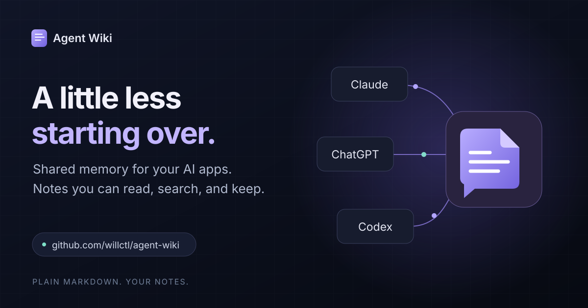

# Agent Wiki



[Watch the 32-second demo](docs/showcase/agent-wiki-demo.mp4) · [Audit findings](docs/security-audit.md)

For trusted local machines. The HTTP service does not isolate OS accounts. Read
[Security](SECURITY.md) before installing on a shared machine or enabling external model calls.

One shared, provider-agnostic memory for every AI session on this computer:
Claude desktop, Claude Code, ChatGPT desktop (Work or Codex mode) and the Codex
CLI. It is a plain-Markdown wiki you own, reached through one local MCP server
(`agent-wiki`), and packaged as one plugin folder that both Claude and ChatGPT
install.

Apps **tell the wiki what happened**, and a **curator** agent organizes it. The
server accepts each write at once into a durable inbox. The curator then files
the notes into pages, links, summaries and the activity log. It runs on your
ChatGPT plan, with `gpt-6.1-sol` at medium reasoning by default (Status >
Models in the window changes it). Reads are
instant and deterministic, because no agent runs on the read path.

Everything users run is two small Rust programs: `agent-wiki` (the MCP server,
the session hook, the curator, the Windows service and the installer) and
`agent-wiki-tray` (the tray or menu bar icon and the Agent Wiki window). You need
Node only to build the window. [docs/rust-plan.md](docs/rust-plan.md) covers the
rewrite and its measurements.

## Install, upgrade, uninstall

```bash
npm install
npm run install-local
npm run uninstall-local
```

`install-local` runs `npm run package`, which builds the payload into
`dist/package`: the window, the icons and the Rust programs. It builds the
programs with `cargo build --release` when cargo is installed, and otherwise
uses the ones already in `rust/target/release`. Then it runs `agent-wiki install`
from `dist/package`. A release ships that folder, and `agent-wiki install` in it
installs the same way.

The install is idempotent. Running it again upgrades in place and never touches
wiki content. Options pass through: `-- --wiki-dir <path>`, `-- --port N` and
`-- --no-approve`. With `--no-approve`, ChatGPT and Claude Code ask before each
wiki tool call.

By default the wiki tools run without asking. The installer sets
`default_tools_approval_mode = "approve"` in `~/.codex/config.toml`, and adds the
`permissions.allow` entries `mcp__plugin_agent-wiki_agent-wiki` and
`mcp__agent-wiki` to `~/.claude/settings.json`. Without those entries, Claude
Code denies the tools outright in `claude -p` sessions. The installer ends with a
self-test of
the server over stdio and HTTP, and of the hook under every shell the apps use.

**On Windows, run it from a normal terminal** (Win+R, `cmd`), not from the
terminal inside the Claude desktop app, the ChatGPT desktop app or the Store
version of PowerShell. Those are app packages. Windows redirects what they
create under `AppData` into the app's private storage
(`%LOCALAPPDATA%\Packages\<app>\LocalCache`), where the service, the tray at
sign-in and the other apps never see it. The installer detects an app package
and stops before changing anything.

`uninstall-local` (`agent-wiki uninstall`) stops the tray and removes its
start-at-sign-in entries, the plugin and marketplaces, the Claude desktop entry,
the instruction blocks and the approval settings. It leaves the wiki, the
programs, `config.json` and the curator's Codex sign-in in place.

After installing, sign the curator in once: tray icon > **Curator** > **Sign in
to ChatGPT for the curator...** (see [The curator](#the-curator)). Until then,
notes wait in the inbox, where you can see them.

The earlier Node runtime and C# tray are retired. The installer refuses `--node`
and a missing Rust build. Legacy source remains for comparison tests and is not
a supported installation target.

## The service

The installer registers a per-machine service that serves Streamable HTTP on
`http://127.0.0.1:47821/mcp`. While the service is healthy, the plugin and
Claude Code connect to it. Otherwise each app starts its own stdio server.

- **Windows:** the service `AgentWiki` runs `agent-wiki service`, which hosts the
  HTTP server in that one process. It starts at boot and runs as the virtual
  account `NT SERVICE\AgentWiki`. That account's only rights are Modify on the
  wiki folder and the logs, and Read on `%APPDATA%\AgentWiki` and
  `%LOCALAPPDATA%\AgentWiki`. Registering the service takes one UAC prompt the
  first time, because the installer starts `agent-wiki install-service`
  elevated. `agent-wiki uninstall-service`, run elevated, removes it.

  Upgrades need no admin rights. An install renames the running program aside
  and puts the new one in place. The service notices the change by file
  identity and stops with an error code. The Service Control Manager's recovery
  action (restart after 2 s, 5 s, 30 s) then starts the new build.

  `install-service` also adds one ACE to the security descriptor of this service
  alone: `(A;;RPWPLC;;;<your SID>)`. It lets your account, and only yours, start
  and stop the service and query its status, so the tray can restart it. The service logs to
  `%LOCALAPPDATA%\AgentWiki\logs\service.log`.
- **macOS:** LaunchAgents `com.agentwiki.server` and `com.agentwiki.curator` in
  `~/Library/LaunchAgents`, running as you.
- **Linux:** systemd user units `agent-wiki.service` and
  `agent-wiki-curator.service`, running as you (`loginctl enable-linger` keeps
  them up while you are signed out).

On macOS and Linux the server runs with `--exit-on-upgrade`, so an install
restarts it the same way. The HTTP endpoints refuse any Host other than
`127.0.0.1` or `localhost`, and any cross-origin browser request, so web pages
cannot reach them, even through DNS rebinding.

## Tools

| Tool | What it does |
| --- | --- |
| `wiki_start` | protocol, page index, recent activity, pending notes, related pages |
| `wiki_search` | BM25 search over sections: each page's intro and its `##` and `###` sections, each log entry, and each note, plus the page's `aliases`. Results cite the section that matched. Filters: `scope` (`all`, `pages`, `log`, `notes`), `since` and `until` dates, and `app`. `queries` takes up to 5 other wordings, searched together and fused by reciprocal rank. With hybrid search on, results also rank by meaning (see Search) |
| `wiki_read` | a page, a log day, a note (`note:<id>`, pending or filed, with what the curator did with it), or any file in the wiki. `slug#section` (or `section`) returns one section with the page's header line |
| `wiki_log` | tell the wiki what happened. The server queues it as a note for the curator, with its `source` |
| `wiki_upsert_page` | hand over content for one page (`append` or `replace`). The server queues it for the curator |

The names are unchanged from v1.1, so open sessions, cached tool lists and your
own `PROTOCOL.md` keep working. Both write tools take an optional
`idempotency_key`. Without one, the server stores the same note (same app, title
and text) only once per day. Since v1.4 they also take an optional `source`:

- `user`: the user said it.
- `observed`: the app checked it.
- `external`: a web page, an email, a document or another tool's output.
- `agent`: the app's own conclusion. This is the default.

Read results turn remote images into plain links, so no app fetches a URL from
the wiki without someone clicking it. `writeMode: "direct"` in `config.json`
restores the v1.1 behavior: immediate deterministic page and log writes, and no
curator.

## The curator

`agent-wiki curator` runs as you, never as the service. It uses your ChatGPT
sign-in through the official Codex CLI, and the service account must not have
that sign-in. On Windows the tray hosts the curator and restarts it when
`agent-wiki` is replaced. On macOS and Linux, a launchd agent or a systemd user
unit runs it. It never reads Codex's credential files.

- **Isolation.** It runs `codex exec` in its own `CODEX_HOME`
  (`%LOCALAPPDATA%\AgentWiki\curator\codex-home`) with `--ignore-user-config`,
  `--ephemeral` and `--sandbox read-only`. It disables plugins, hooks, apps,
  memories, shell and multi-agent tools, and turns web search off. It needs a
  separate home because Codex always loads `~/.codex/AGENTS.md` (our pointer) and
  has no switch to stop that. A run with that file loaded tried to reach the wiki
  tools. The separate home needs its own one-time `codex login` (tray > Curator >
  Sign in).
- **Structured output.** The model returns an edit plan (`--output-schema`) with
  three parts:
  - for each page, `create` (full body), `patch` (exact-match find-and-replace
    edits) or `replace`, each with the page's base hash;
  - for each note, a disposition (integrated, log_only, duplicate, ignored) and
    a reason;
  - log entries.

  The curator validates the plan: ids, slugs, hashes, edits that match exactly
  once, and the secret guard on everything the model wrote. If validation fails,
  it asks the model once for a repair. Then it applies the plan
  deterministically.
- **Pages hold the current state.** When a fact changes, the curator updates it
  in place and adds one line to the page's `## History` section: the date, what
  changed and the old value. Verification steps, test counts and timings go to
  the log entry, not the page. A change that would take a page over the soft cap
  (`pageCapChars`, 12,000 characters) gets one repair round, which asks the model
  to move a section to a new, linked page instead. The curator never cuts
  content to fit. It names any page that does not fit in the model's context
  (`contextChars`) in the audit record and in `/status`, and never skips a page
  silently.
- **Trust gate.** Code, not only the prompt, flags a page change in two cases:
  - any note behind it is `external`;
  - its notes are not all from `user`, and it changes a `preference` page, adds
    an instruction-like line ("Always ...", "from now on", "ignore ..."), or adds
    a link to anything but this machine.

  Flagged changes go to `.curator/held/<batch>.json`. The **Approvals** setting
  at the top of the window's Inbox decides what happens next:
  - **Automatic** (the default): the curator applies the change in the same
    step that files the batch, and the tray shows the notification "Agent Wiki
    applied a change". Clicking it opens the Inbox. The tray remembers what it
    announced in `tray-state.json` next to its `tray.ini`, so a restart repeats
    nothing and misses nothing. The Inbox lists the changes from the last 7 days
    under "Applied automatically", each with its reason, its diff and an
    **Undo** button. Undo puts the page back if nobody has edited it since. A
    cleanup that touched several pages (a split) is undone as a whole. A change
    that no longer fits its page (the page changed since) waits under "Needs your
    OK" instead, and the log says why.
  - **Ask me first**: the change waits, the rest of the batch applies, and the
    log says the change is waiting. The Inbox shows each waiting change with its
    reasons, its notes and a diff, and offers **Approve**, **Reject** and **Send
    back**. Send back returns its notes to the curator. `/status` reports "N
    change(s) need your OK", so the tray shows that something needs attention.
    Switching back to Automatic applies everything that is waiting.

  The setting is `approvals` (`auto` or `manual`) in
  `.curator/settings.json`, so it travels with the wiki. A file that cannot be
  read or understood counts as Ask me first, and `/status` names the problem.
  Forget requests always wait for your OK. If an installed wiki's `PROTOCOL.md` was never edited, an
  install replaces it with this release's copy.
- **Cleanup schedule.** On a schedule, daily at 03:00 by default, the curator
  reviews each page that changed since its last review, one page at a time when
  it has nothing to file. It also reviews a page soon after the page grows past
  the size cap. A scheduled time missed while the computer slept is caught up
  when the curator is next idle. The review sees the
  index, the recent log, and what code checks by itself: broken `[[links]]`,
  orphan pages and size. It looks for contradictions, stale "pending" items,
  time-relative wording, facts the log has since changed, an outdated summary,
  work narration and pages to split.

  With Automatic approvals, the curator applies each cleanup, notifies you and
  lists it for Undo, like any flagged change. A cleanup goes in whole or not at
  all, and what it wrote counts as reviewed, so the page is not reviewed again
  until something else changes it. With Ask me first, the cleanup
  waits in the Inbox as "Proposed cleanup", with a diff, **Approve** and
  **Approve all cleanups**. The first pass after install tidies the pages
  written before these rules. `agent-wiki curator --lint [slug...]` runs a
  review now.

  Change the schedule in the window's Inbox, under the Approvals switch:
  **Daily** or **Weekly** at a time you pick, **Custom** for any cron schedule
  (with its next three times shown as you type), or **Off**. It is
  `cleanupSchedule` in `.curator/settings.json`: a five-field cron expression
  in the computer's local time (minute, hour, day of month, month, weekday;
  for example `0 3 * * 1-5` for weekdays at 03:00, or `0 */6 * * *` for every
  six hours), `@daily`-style shortcuts, `daily`, `weekly` (Mondays at 03:00)
  or `off`. A schedule that cannot be read runs the default, and `/status`
  names the problem. `curator.lint: "off"` in one computer's `config.json`
  turns cleanups off there, whatever the wiki's schedule says.
- **Revert.** Each curator page change in the window's Activity has a **Revert**
  button. It restores the `.history/` copy if the page is still exactly what
  that batch wrote, which it checks against the audit record's hashes.
  Otherwise it offers to ask the curator, in a note from you, to undo the change
  on the current page.
- **Forget.** The window's Status tab has a Forget box. It lists every copy of a
  piece of text, with the text masked: pages and their `.history/`, filed notes,
  audit records, held changes, Ask, the log, the inbox and the request logs.
  Then it redacts every copy and leaves a tombstone in `.curator/forgotten/` that
  records how much it redacted, never the text. `agent-wiki forget "<text>"
  [--yes]` does the same from a terminal. When you ask an app to make the wiki
  forget something (a note from `user`), the curator records a forget request
  instead of copying the text anywhere, and the Inbox asks for your OK. Forget
  does not rewrite a git history of the wiki.
- **Nudge before stopping (opt-in).** The plugin also registers a Stop hook
  (`agent-wiki hook stop`, for Claude Code and Codex). With `"hooks": {"nudge":
  true}` in `config.json`, the hook asks the model to log what is worth keeping
  before it stops. It asks once per session, and only when the transcript is
  long (`nudgeMinLines`, 30) and has no `wiki_log` call. Without that setting it
  does nothing.
- **Sources stay reachable.** Each log entry ends its header with a
  `sources: note:<id>` line. `wiki_read("note:<id>")` opens that note wherever
  it is, in the inbox or in `.curator/done/`, with the curator's disposition and
  the pages it changed. Search covers filed notes and ranks them below pages and
  the log. The window opens a filed note from search or from an activity entry.
- **Concurrency.** Commits take the wiki write lock and re-check every base
  hash. If someone edits a page in the meantime, the curator plans again on the
  new content, up to 5 times, and never loses the edit. Commits go through a
  write-ahead journal, so after a crash at any point the curator completes the
  commit on restart, exactly once.
- **Throughput.** The curator waits until 20 s pass with no new note, but never
  more than 2 min, then files batches of up to 12 notes. Failures back off exponentially,
  from 1 min to 1 h. After 5 failures a note becomes a dead letter, shown in the
  tray and in `wiki_start`. From the tray you can **Retry** it or **File as
  sent**. When the curator is signed out or hits a usage or rate limit, notes
  wait without using up attempts.
- **Audit.** The curator writes `.curator/audit/YYYY/MM/<id>.json` for every
  filed note. It records what changed, why, the base and new hashes, the
  `.history/` copy, the model and the batch.
- **Models.** The window's Status tab has a **Models** card. For the curator
  and for Ask, pick a model from your ChatGPT account's list and a reasoning
  level, or keep the default: `config.json`, then `gpt-6.1-sol` with medium
  reasoning for the curator, and the curator's model with low reasoning for
  Ask. The list is Codex's own list of the models your account offers
  (`models_cache.json` in the curator's Codex home), which the curator copies
  into `.curator/models.json` so the window can show it. A model or reasoning
  level the account does not offer is refused, with what it does offer. A
  chosen model the account stops offering shows in `/status`, the window and
  the tray. A change applies from the next run, with no restart. When Codex
  refuses a model, the curator waits instead of failing notes, and tries again
  as soon as you choose another. From a terminal, `agent-wiki models` shows
  what each one uses and the account's models;
  `agent-wiki models set curator gpt-6-astra --effort high`,
  `agent-wiki models set ask --effort medium` and
  `agent-wiki models reset ask` change them (`--force` saves a model the
  list does not have). The choice is `models` in `.curator/settings.json`.
  The tray's Curator menu shows both models.
- **Settings.** The `curator` object in `config.json` (see
  [What goes where](#what-goes-where)) takes `model` (`gpt-6.1-sol`) and
  `reasoningEffort` (`medium`), the defaults under the window's choice, and
  `debounceSeconds`, `maxWaitSeconds`, `batchMax`, `batchChars`,
  `contextChars`, `pageCapChars`, `lint` (`off` turns cleanups off on that
  computer), `maxAttempts`, `timeoutSeconds`, `codexPath` and `codexHome`. To pause or
  resume the curator, use the tray menu, or create or delete `.curator/paused`.
- **Command line.** `agent-wiki curator --once` (file what is due, then exit),
  `--lint [slug...]` (review pages now), `--retry-dead`, `--file-raw-dead`,
  `--login-status`, `--asks-only`.

v1.2 added two parts to the wiki layout. `inbox/<id>.md` holds pending notes as
plain Markdown, and you can drop notes there by hand too. `.curator/` holds
keys, state, journal, done, audit, status, and `asks/` for
[Ask](#ask-agentic-search).

## Search

Plain search is BM25 over sections and needs no model; it stays the default.
Two additions make it find a page by other words than its own:

- **Aliases.** The curator writes an `aliases` line on each page: the other
  words a person would search for it with ("Portugal, travel" on a Lisbon
  trip). Scheduled cleanups add them to existing pages. Search weights them
  like tags.
- **Hybrid search (opt-in).** Each section is embedded once by a hosted model
  through OpenRouter, and a search combines BM25 with the cosine similarity
  of each file's best section (a convex combination of normalized scores).
  Questions lean on meaning (weight 0.9) and a few keywords on words (0.5).
  A query that names a date stays BM25, because embeddings know no dates. The
  query's embedding has 1.5 s; after that, or with no key or no network, the
  search is BM25 alone.

Turn hybrid search on in `config.json`:

```json
"search": { "embeddings": { "enabled": true, "credential": "AgentWiki/OpenRouter" } }
```

The API key is read from `OPENROUTER_API_KEY` or, by the `credential` name,
from Windows Credential Manager (a generic credential), the macOS keychain (a
generic password) or the Linux secret service. Agent Wiki never stores it.
`model` defaults to `google/gemini-embedding-2`; `weight`, `keywordWeight`
and `queryTimeoutMs` adjust the rest. Requests ask OpenRouter for providers
that neither collect nor retain the text, so the wiki's sections and the
queries go to OpenRouter and the model's provider under that policy. The
curator embeds new and changed sections when idle;
`agent-wiki embeddings status` and `agent-wiki embeddings sync` do it by
hand. Vectors live in `.curator/vectors/<model>/`, and Forget deletes them
all so nothing of a forgotten text survives there. On Windows the service runs
as its own account, which cannot read your credentials, so the tray hands it
the key over a local pipe that only you and the service can open; the service
keeps it in memory, never on disk. The tray first checks that the pipe belongs
to the service's account and to the process `/status` names, so no other
program can receive the key. `/status` shows `embeddings.keyAvailable`;
without the tray running, searches through the service stay BM25.

[docs/search-plan.md](docs/search-plan.md) has the measurements: on the hard
eval set, plain search found 26 of 55 answers first and hybrid search 48 (exact
McNemar p < 0.001), and notes routed to their page went from 4 of 12 first to
12 of 12.

## Ask (agentic search)

The window's **Ask** tab (and the first row of every search) hands a question
to an agent that searches and reads the wiki for you, then answers with the
files it relied on. It runs in the curator process, as you, for the same reason
the curator does: the service account must not have your ChatGPT sign-in.

- **The agent.** Ask uses the curator's isolated `codex exec`, with the same
  `CODEX_HOME`, the same features off and no shell. It gets exactly one MCP
  server, `agent-wiki serve --read-only`. That server offers `wiki_search` and
  `wiki_read` and nothing that writes. It does not even create the skeleton,
  break locks or refresh the index. Codex's `enabled_tools` also lists only those
  two. The prompt carries the page index and up to three earlier turns of the
  conversation. The answer comes back as JSON: `answer` in Markdown with
  `[[links]]`, `found`, and `sources` with a supporting quote each.
- **The queue.** The service writes `.curator/asks/<id>/ask.json`. The worker
  claims it with an exclusive create, and it runs at most 2 questions at a time.
  As Codex reports each step (searched for X: N results, read page Y, a remark),
  the worker appends it to `events.jsonl`. At the end it writes `result.json`.
  The window polls `/api/ask?id=&after=N`. **Stop** writes a `cancel` file. A
  question that no worker picks up within 10 minutes expires. If a question's
  worker stops sending heartbeats for 90 s, the question is marked interrupted.
  The worker keeps questions for 14 days, at most 200. While the worker's
  heartbeat (`asks/worker.json`) is stale, the service refuses new questions
  with a 503 and the reason. It also refuses a question that contains a secret.
- **Settings.** The `ask` object in `config.json` takes `model` (default: the
  curator's) and `reasoningEffort` (`low`), the defaults under the window's
  choice (Status > Models), `timeoutSeconds` (180),
  `maxConcurrent` (2), `queueSeconds` (600), `keepDays` (14) and `keepMax` (200).
- **Request log.** The curator writes `kind: "ask"` lines (start, done with
  result, searches, reads, sources, usage). The agent's own tool calls appear as
  `proc: "ask"` lines tagged `ask: <id>`.

## Tray app

`agent-wiki-tray` runs one instance per session, on Windows (notification area),
macOS (menu bar) and Linux (StatusNotifierItem). It talks to the service only
over HTTP (`GET /status`) and shows healthy, degraded (backlog, failed notes,
curator signed out or erroring, server errors) or down. **Left click** opens the
Agent Wiki window (below). **Right click** shows the menu:

- Open Agent Wiki;
- status (version, uptime, queue, last write, reasons);
- open the wiki folder, `index.md` or the logs;
- recent activity;
- pause or resume the curator;
- Curator (sign in, retry or file failed notes, restart, its log);
- Start at sign-in;
- copy MCP URL;
- restart service;
- quit.

Starting the tray again while it runs opens the window. The icon is a dog-eared
page with a speech-bubble tail, because what the apps say becomes wiki pages. It
is indigo when healthy, has an amber dot when it needs attention, and is grey
with a red dot when the service is down. `assets/icon/agent-wiki-16.svg` is
fitted to the 16 px grid that the tray uses at 100% scaling, and
`agent-wiki.svg` draws 20 px and up. `npm run icons` builds `dist/icons/*.ico`
(16 to 256 px) and `dist/icons/preview.png`, which shows every state and size on
light and dark taskbars.

**The Agent Wiki window.** The window is a React app (`ui/`, built by
`npm run build`) that the service serves at `http://127.0.0.1:47821/ui/`. The
tray shows it in its own small window: WebView2 on Windows, WKWebView on macOS
and WebKitGTK on Linux, with its own data folder of a few MB. It opens above the
tray. Links that leave `127.0.0.1` open in your browser. When you close the
window, the tray hides it and frees it after five idle minutes, so the tray
stays small: about 11 MB with the window closed, measured on Windows (run count
not recorded). The window has a search box and five tabs:

- **Search** (`/` or Ctrl+K, then arrow keys and Enter) covers pages, notes
  waiting for the curator and the activity log, with highlighted snippets. The
  first row asks the wiki instead. The window selects it when the query reads
  like a question, and Ctrl+Enter picks it from anywhere in the box.
- **Ask** sends a question to an agent that searches and reads the wiki (see
  [Ask](#ask-agentic-search)). Each search and read appears as it happens, then
  the answer with numbered sources. Follow-ups keep the conversation, and the tab
  lists recent conversations.
- **Pages** filters by type and renders each page from Markdown, with clickable
  `[[links]]`, **Linked from** (backlinks), **Links to**, earlier versions, and
  actions that copy the `[[link]]` or the file path.
- **Activity** shows the log by day (what happened, page changes, or
  everything), with each entry's app and linked pages, and its full text on a
  click.
- **Inbox** lists notes waiting for the curator (waiting, retrying, or failed
  with the last error), and has pause and resume.
- **Status** shows the service, the curator (model, sign-in, last run), the
  queue and requests.

The window follows the system's light or dark theme. It reads a small JSON API
on the same port: `/api/status`, `/api/pages`, `/api/page?slug=`,
`/api/search?q=`, `/api/activity?days=`, `/api/log?date=`, `/api/inbox`,
`/api/asks` and `/api/ask?id=&after=&thread=1`. The writes are
`POST /api/curator {"paused": bool}`, `POST /api/ask {"question", "parent"?}`
and `POST /api/ask/cancel {"id"}`. Each write needs the `X-Agent-Wiki: ui`
header, which another site's page cannot send. The API refuses the same Hosts
and Origins as `/mcp`, and any request a browser marks as sent by another site
(`Sec-Fetch-Site` other than `same-origin` or `none`). The window's pages get a strict CSP, and nothing in a
wiki page runs: raw HTML shows as text, and only `http`, `https` and `mailto`
links work. To work on the window, run `npm run ui:preview`. It serves a
snapshot copy of your wiki on port 47899 (`http://127.0.0.1:47899/ui/`) and does
not touch the real one.

**Start at sign-in.** On Windows the tray has two independent per-user entries,
and neither needs admin rights: the Task Scheduler logon task `AgentWikiTray`
(runs as you, normal priority, no time limit) and `HKCU\...\Run\AgentWikiTray`.
Either one starts the tray, and whichever starts second exits. There are two
because on 2026-10-02 the Run value alone disappeared overnight on this managed
PC. Something outside Agent Wiki removed it. On macOS the entry is a
LaunchAgent, and on Linux it is an XDG autostart entry. The tray checks its
entries every 2 minutes and writes any change, with the time window, to
`logs/tray.log`. The log also records when the tray started and which entry
started it. The tray never re-adds an entry by itself. Restoring its own
persistence is what malware does, and endpoint security treats it that way.
**Start at sign-in > Repair** (`agent-wiki-tray --do repair-autostart`) or the
installer registers the entries again.

**Tray icon.** Windows 11 puts new tray icons in the hidden overflow (^), and
only you can pin one. To pin it, open Settings > Personalization > Taskbar >
Other system tray icons, and turn Agent Wiki on. Explorer keeps that choice
itself, so the installer only reports where the icon is.

For headless use, the tray takes these flags:

- `--selftest` prints the state, the start-at-sign-in entries and the menu.
- `--do <action>` runs one menu action: `open-ui`, `open-wiki`, `open-index`,
  `open-logs`, `pause`, `resume`, `copy-url`, `sign-in`, `retry-dead`,
  `file-raw`, `restart-service` or `repair-autostart`.
- `--quit` stops the running tray.
- `--window` opens only the window.

## Request log

Every HTTP request, every tool call (stdio and HTTP) and every curator run is
one JSON line in `logs/requests-YYYY-MM-DD.jsonl` (`%LOCALAPPDATA%\AgentWiki\logs`
on Windows). Each line has the time, request id, process, transport, client name
and version, `app`, tool, a short redacted argument summary, duration, result
and error. The client name and version come from `initialize`. Over stateless
HTTP, they come through an `Mcp-Session-Id` that the server hands out at
initialize. The same guard that refuses secrets redacts them, before truncation.
Several processes append at once, so each line is a single append-mode write
under 4 KB, which is atomic on Windows and POSIX. The files roll over daily, and
by size within a day. Retention is 30 days (`logs.retentionDays`).

## What goes where

Agent Wiki's own files live in the platform's standard folders, never in a dot
folder in your home. On Windows:

| Path | What |
| --- | --- |
| `%APPDATA%\AgentWiki\config.json` | `wikiDir`, `version`, `httpPort`, `writeMode`, `curator`, `logs` |
| `%LOCALAPPDATA%\AgentWiki\runtime\` | `agent-wiki.exe` and `ui/` (the Agent Wiki window) |
| `%LOCALAPPDATA%\AgentWiki\service\` | the service's ini |
| `%LOCALAPPDATA%\AgentWiki\tray\` | `agent-wiki-tray.exe`, its ini, its logon-task definition, icons and the window's data folder (`webview\`) |
| Task Scheduler `\AgentWikiTray`, `HKCU\...\CurrentVersion\Run\AgentWikiTray` | start the tray at sign-in |
| `%LOCALAPPDATA%\AgentWiki\curator\codex-home\` | the curator's own Codex home and sign-in (Local, not Roaming: it stays on this PC) |
| `%LOCALAPPDATA%\AgentWiki\logs\` | `service.log`, `curator.log`, `tray.log`, `requests-*.jsonl`, `http-sessions.json` |
| `%LOCALAPPDATA%\AgentWiki\state\` | `install-state.json` (what the installer created, for uninstall) |
| `%LOCALAPPDATA%\AgentWiki\marketplace\` | local marketplace (Claude and Codex formats) and the rendered plugin |
| `%LOCALAPPDATA%\AgentWiki\paste-into-app-settings.md` | the pointer text, for app personal-instruction settings |
| `~/AgentWiki/` | the wiki (a folder of your documents, not app data) |
| `~/.agents/plugins/marketplace.json` | ChatGPT and Codex personal marketplace entry (Codex's folder) |
| `~/.codex/config.toml` | `[plugins."agent-wiki@personal".mcp_servers.agent-wiki]` auto-approval |
| `~/.codex/AGENTS.md`, `~/.claude/CLAUDE.md` | managed `AGENT-WIKI` instruction block |
| `claude_desktop_config.json` (MSIX: `%LOCALAPPDATA%\Packages\Claude_*\LocalCache\Roaming\Claude`) | `mcpServers.agent-wiki` for ordinary Claude desktop chats |

On Linux the same files go to the XDG folders (`~/.config/agent-wiki`,
`~/.local/share/agent-wiki`, `~/.local/state/agent-wiki` with `logs/`,
`~/.cache/agent-wiki`). On macOS they go to `~/Library/Application Support/Agent
Wiki`, `~/Library/Logs/Agent Wiki` and `~/Library/Caches/Agent Wiki`. On both, a
set `XDG_*` variable wins. `AGENT_WIKI_HOME=<dir>` puts everything in one folder
instead. The tests and `ui:preview` use it. Each of
`AGENT_WIKI_{CONFIG,DATA,STATE,LOG,CACHE}_DIR` sets one kind of folder. The
service gets these variables from its ini, because its own profile is not yours.

Agent Wiki looks for the wiki folder in this order: the `AGENT_WIKI_DIR`
environment variable, then `wikiDir` in `config.json`, then `~/AgentWiki`. The
installer seeds `PROTOCOL.md` into a new wiki. In an existing wiki it replaces
the file only when it is an unedited earlier default, so it never overwrites
your edits.

Before it changes an existing config file, the installer copies it once to
`<file>.bak-agent-wiki` and never overwrites that first backup. Then it merges
its changes in and keeps the file's line endings.

## Repo layout

```
rust/crates/core/      aw-core: paths, pages and frontmatter, index, log, search, read, inbox, locks,
                       request log, secret guard, the curator, Codex runs, Ask's worker
rust/crates/cli/       agent-wiki: serve (MCP over stdio and HTTP, /health, /status, /ui, /api), hook,
                       curator, service (Windows), install and uninstall
rust/crates/tray/      agent-wiki-tray: the tray or menu bar icon, its menu, and the window
protocol/PROTOCOL.md   rules every session follows (seeded into a new wiki; you own the wiki copy)
protocol/POINTER.md    short global-instruction block
ui/                    the Agent Wiki window (React): index.html, src/main.jsx, app.css, markdown.js, api.js
assets/icon/           icon sources (SVG)
plugin/                plugin source; __PLACEHOLDERS__ are filled at install time
scripts/               build (the window), icons, package, install-local, ui-preview, eval, bench
src/, service/, tray/  the earlier Node runtime and C# service wrapper and tray (install-local --node)
eval/synthetic/        the memory eval's synthetic wiki, questions and curator note streams
eval/local/            your own real-wiki questions (gitignored)
test/                  the suites: e2e (two real MCP clients, both transports), curator (fake model),
                       tray, installer, the window (ui), Ask (the fake model drives the real read-only
                       server), migrate, portable (Linux/macOS differences), memory-eval, opt-in live
                       and stress tests
.github/workflows/     CI: the suites on Windows, Ubuntu and macOS, against Node and Rust
```

The suites talk to the programs over MCP, `/api` and their files, so they are
the contract for both implementations: `AGENT_WIKI_IMPL=rust node --test ...`
runs them against the Rust programs (`rust/target/release`, or
`AGENT_WIKI_RUST_BIN`). CI builds, lints (`cargo clippy -D warnings`) and tests
the Rust programs on all three OSes and uploads the install payload for each.
`npm run bench` measures the footprint and speed of the Node runtime against the
Rust program. It alternates 5 runs per side, reports each metric's median and
range, checks every answer, and exits 1 on any error. Use
`AGENT_WIKI_IMPL=node|rust` to measure one side. The memory eval is described in
[docs/memory-eval.md](docs/memory-eval.md).

## Design notes

- Locks use `mkdir .locks/<name>.lock`, the same mutex v1.1 used, so old and new
  servers exclude each other during an upgrade. An `owner` file holds the pid,
  the process start time and a token. Every process also holds
  `.locks/alive/<pid>-<start>.alive` open with share mode 0 for its lifetime.
  Windows closes that file the moment the process dies, so any process, under
  any account, can detect a dead owner and break its lock at once. Another
  process breaks a live owner's lock only after 5 minutes.
- Every write goes to a temp file, then fsync, then rename, with LF line endings
  only. Readers never see a partial file. The server acknowledges a note only
  after it is fsync'd.
- The plugin points at a stable runtime outside the apps' plugin caches, with
  absolute paths written at install time. The hook command uses an 8.3 short
  path when the program's path has spaces, so it runs identically under bash,
  cmd and PowerShell.
- The HTTP server is a small purpose-built HTTP/1.1 server: a thread per
  connection (at most 128), whole request bodies read up front with a 4 MiB
  cap, strict parsing (no line folding, no Content-Length with
  Transfer-Encoding, exactly one Host), and one write per response.
- Windows opens files slowly, because each open is scanned. So the server keeps
  the request log open and caches read-only views of pages, log days and notes,
  keyed by their directory listing's size and time. The release build optimizes
  for size, because launching a larger program costs a longer scan.
